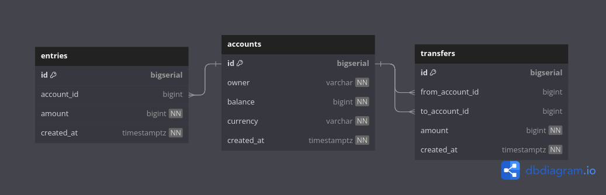

# DATABASE Design

- Design DB schema : Design a SQL DB schema using <https://dbdiagram.io>
- Save & share DB diagram : Save the DB schema as PDF/PNG diagram and share it
- Generate SQL Code : Generate code to create the schema in a target database engine : Postgres / MySQL

## DB DIAGRAM

