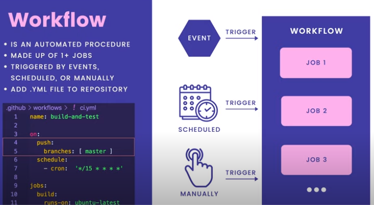
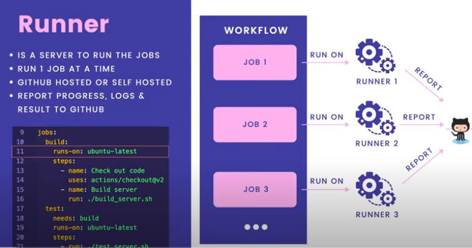
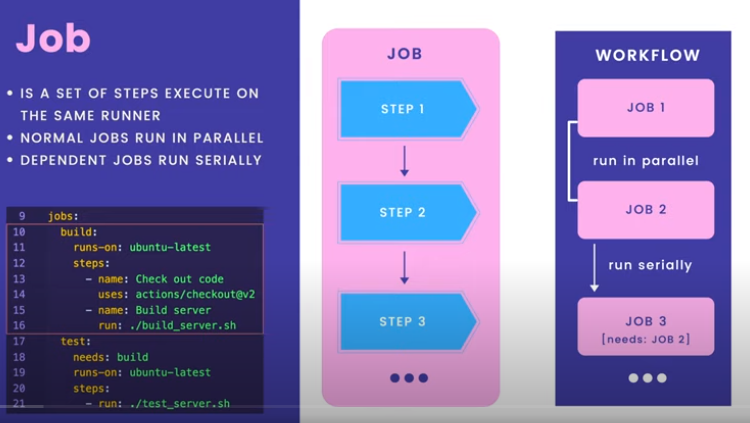
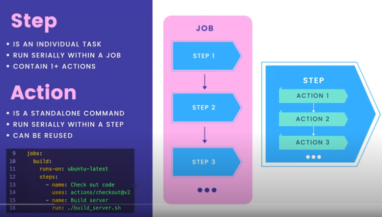
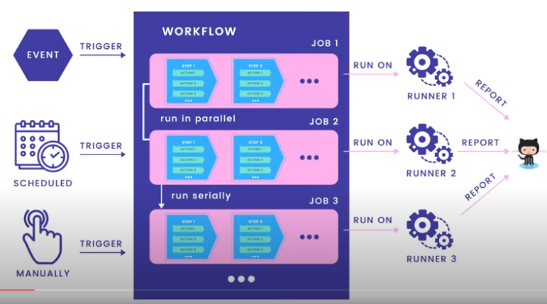

# Github actions for CI/CD

- Ensure high quality code
- Ensure code is tested
- Ensure code has no errors

## Github actions

- Github actions are a way to automate tasks
- Github actions are defined in a file called `main.yml` in the `.github/workflows` folder
- Github actions are triggered by events
- Github actions can be triggered by a push to a branch, a pull request, a tag, etc.
- Github actions can be triggered by a cron job
- Github actions can be triggered by a manual trigger
- similar to Jenkins, CircleCI, TravisCI, etc.

## Workflow

## Runner

## Job

## Step

## Summary

