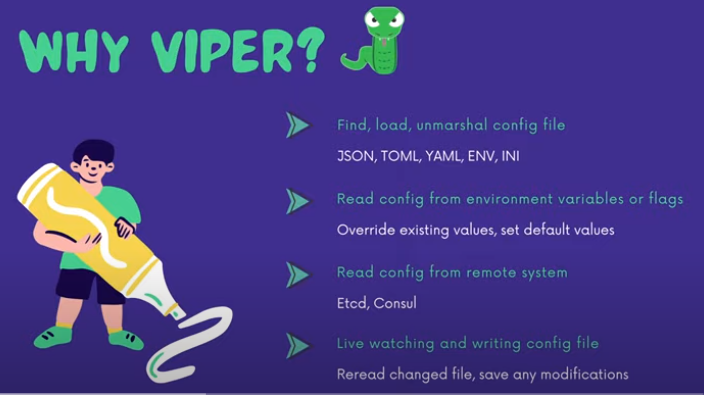
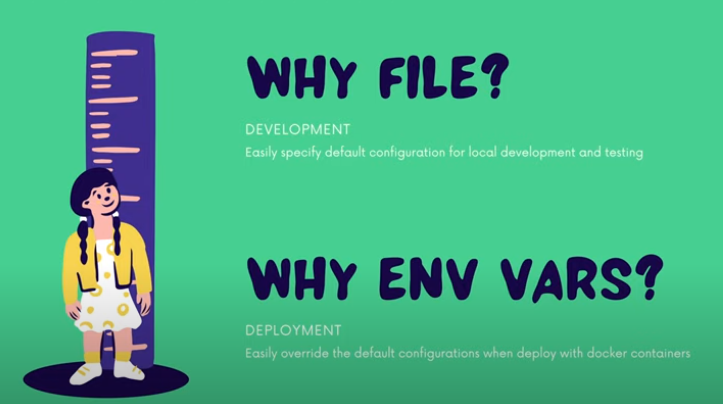

# Load Config from file & env vars with Viper

## Why Viper?

Viper is a complete configuration solution for Go applications including 12-Factor apps. It is designed to work within an application, and can handle all types of configuration needs and formats. It supports:

## Why file / env vars?

