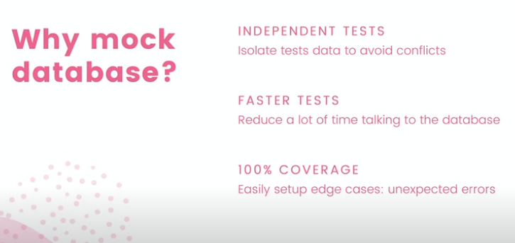
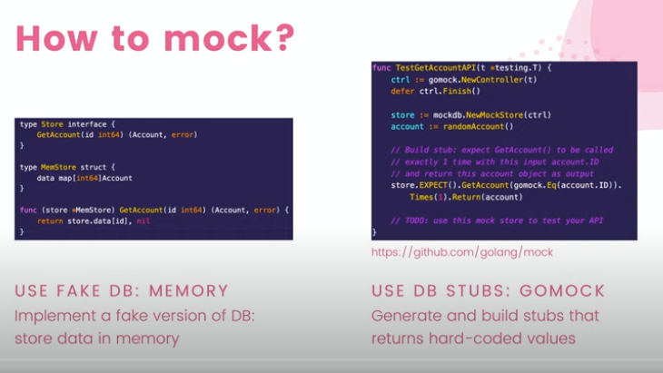

# Mock DB for testing HTTP API in Go

 "mock" typically refers to the practice of creating simulated versions of certain components or objects for the purpose of testing. Mock objects are used to mimic the behavior of real components in a controlled manner during testing, without actually executing the real implementation.

## Why mock DB?

## is it good enough to test our API with a mock DB?

- YES! OUR REAL DB STORE IS ALREADY TESTED
- MOCK DB & READ DB SHOULD IMPLEMENT THE SAME INTERFACE

## How to mock DB?

`mockgen --destination db/mock/store.go github.com/abdulrahman-02/G-Bank/db/sqlc Store`
