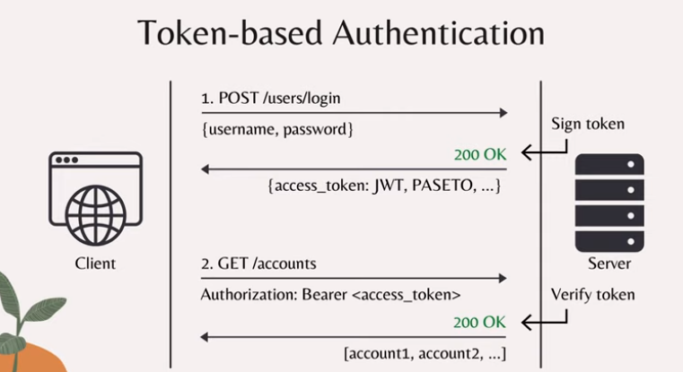
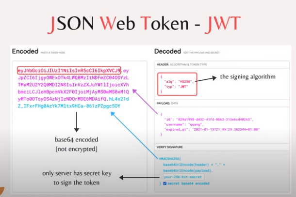
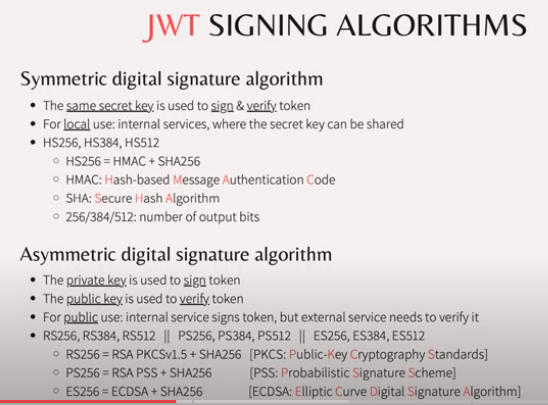
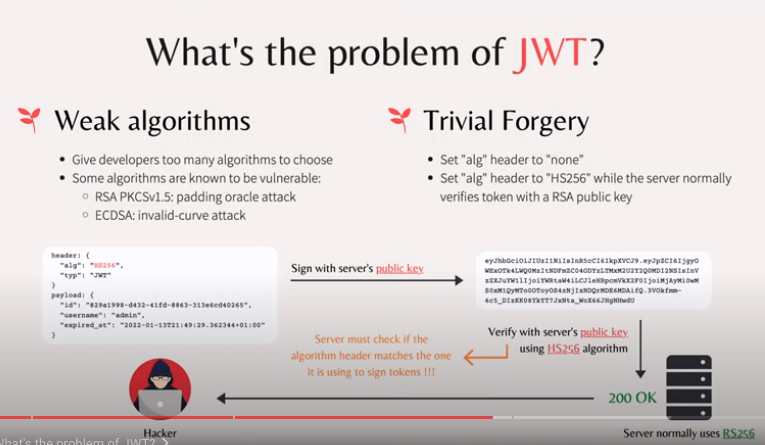
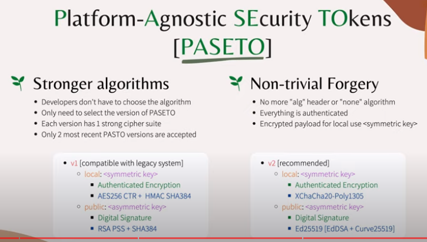
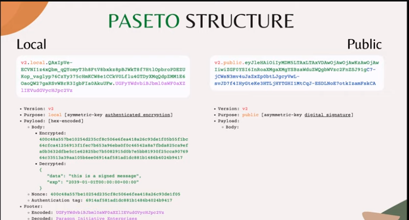

# Why PASETO is better than JWT

## Token-based authentication

## JSON Web Token (JWT)

## JWT Signing Algorithms

## What's the problem with JWT?

## Platform-Agnostic Security Tokens (PASETO)

## PASETO Structure

