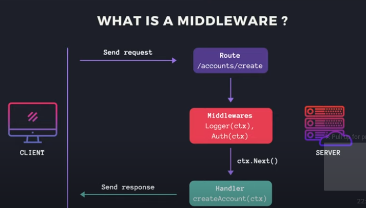

# How to implement authentification middleware and authorization in Golang using Gin

## What is a middleware?

A middleware is a function that is called before the main handler. It is used to do some pre-processing on the request and/or the response. It can be used to do some logging, authentication, authorization, etc.

## Authorization

Authorization is the process of determining if the user has the right to access a resource. It is usually done after the authentication.

