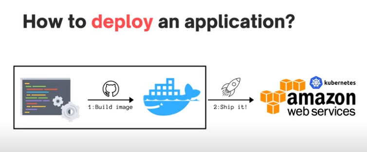

# Build a minimal Golang Docker image with a multistage Dockerfile

## How to deploy an application

## Branching strategy

- never push changes directly to master branch
- create a new branch for each feature
- create a new branch for each bugfix
- `git checkout -b <branch-name>` to create a new branch and switch to it

## Dockerfile

- `docker build -t G-Bank:latest .` to build the image
