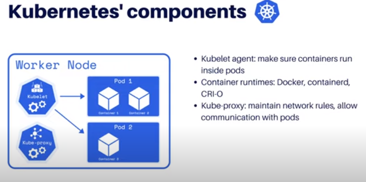
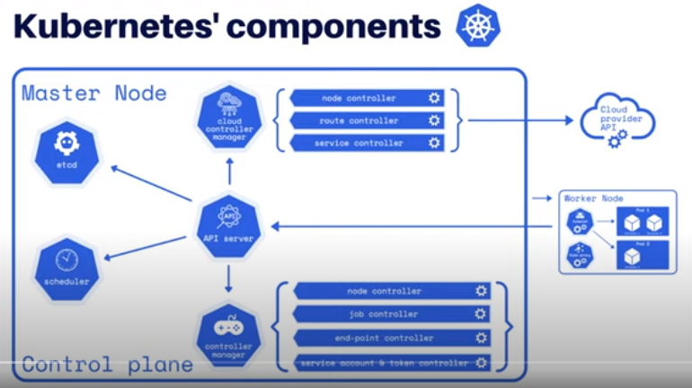

# How to create an AWS EKS Cluster

## What is Kubernetes?

Kubernetes is an open-source container-orchestration system for automating application deployment, scaling, and management. It was originally designed by Google and is now maintained by the Cloud Native Computing Foundation. It aims to provide a "platform for automating deployment, scaling, and operations of application containers across clusters of hosts". It works with a range of container tools, including Docker.

## Kubernetes' components

---

