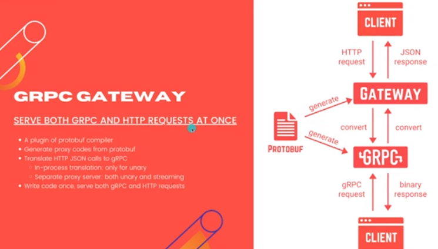

# Write code once, serve both gRPC & HTTP requests

## gRPC Gateway



## Install gRPC Gateway

```bash
# Install protoc
go install \
    github.com/grpc-ecosystem/grpc-gateway/v2/protoc-gen-grpc-gateway \
    github.com/grpc-ecosystem/grpc-gateway/v2/protoc-gen-openapiv2 \
    google.golang.org/protobuf/cmd/protoc-gen-go \
    google.golang.org/grpc/cmd/protoc-gen-go-grpc
# Clone googleapis
git clone https://github.com/googleapis/googleapis.git
cp googleapis/google/api/annotations.proto /proto/google/api
cp googleapis/google/api/field_behavior.proto /proto/google/api
cp googleapis/google/api/http.proto /proto/google/api
cp googleapis/google/api/httpbody.proto /proto/google/api
```
