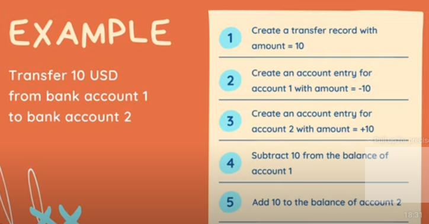

# DB Transaction in Golang

## What is a db transaction

- A Single unit of work
- Often made up of multiple db operations
 

## Why do we need db transaction?

1. To provide a reliable and consistent unit of work, even in case of system failure
2. to provide isolation between programs that access the database concurrently

- The database must satisfy the ACID PROPERTY

## ACID PROPERTY

- Atomicity : Either all operations complete successfully or the transaction fails and the db is unchanged.
- Consistency : The db state must be valid after the transaction. All constraints must be satisfied.
- Isolation :  Concurrent transactions must not affect each other.
- Durability :  Data written by a successful transaction must be recorded in persistent storage

## How to run SQL TX

`BEGIN;
`...`
`COMMIT;`

- if any query fails we rollback
`BEGIN;
`...`
`ROLLBACK;`
